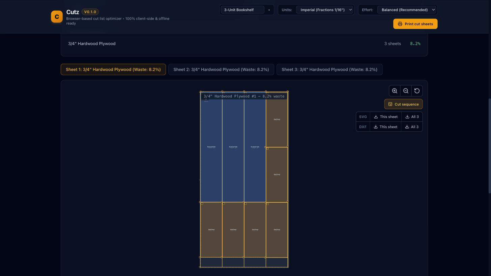

# Cutz

A free, browser-based cut list optimizer for hobbyist woodworkers. Give it your parts and
the sheet goods you have on hand, and it works out how to cut them with the least waste -
respecting saw kerf, grain direction and material thickness.

**[Open it here -> carloswaibl.github.io/Cutz](https://carloswaibl.github.io/Cutz/)**



## What it does

- **Enter parts by hand, or import them.** Drop in an SVG from Inkscape, Illustrator or
  Fusion, or an STL of a single flat panel, and it pulls out the shapes, sizes and quantities.
- **Cuts you can actually make, on the machine you actually own.** Tell it which one you have.
  On a **table saw** every layout is guillotine-decomposable - a sequence of edge-to-edge cuts,
  with the cut order to follow. On a **CNC router** it nests the real outlines instead, turning
  parts to angles and packing them inside each other's corners, because a router can reach where
  a blade cannot. Table saw is the default and nothing about it changed when nesting arrived.
- **Irregular parts stay irregular.** A curved bracket or an L-shaped gusset keeps the outline it
  was drawn with, all the way through to the SVG and DXF you export. On a table saw you still get
  its bounding box, because that is what a blade can cut - and the diagram shows you the shape
  inside the blank so you know what you are cutting to afterwards.
- **Kerf, grain and edge trim are real constraints.** Adjacent parts are spaced by the blade
  width or the cutter diameter. Grain-locked parts are never rotated off their grain, because
  rotating one gives you a visibly wrong panel. Factory edges get trimmed off the usable area.
- **Imperial or metric.** Type `23-1/4`, `23 1/4` or `23.25` - all three work.
- **Printable cut sheets**, with an ordered cut sequence you can follow at the saw. On a router
  there is no cut sequence and the page says so rather than inventing one.
- **SVG and DXF export**, one file per sheet.
- **Multiple projects**, saved locally and still there when you come back.

## It runs entirely in your browser

There is no server, no account and no telemetry. Your parts, your stock and your layouts are
stored in your own browser's IndexedDB and never leave your machine. Once the page has
loaded it keeps working offline, which matters in a shop with bad wifi.

The flip side: projects are local to one browser on one machine. There is no cross-device
sync, by design.

## Running it locally

Node 24 (see [`.nvmrc`](.nvmrc)).

```bash
npm install
npm run dev        # dev server
npm run build      # production build into dist/
npm run preview    # serve that build locally
npm run test:run   # test suite, single run
```

`npm run typecheck` and `npm run lint` round out what CI checks. `npm run bench` runs the
solver benchmark suite against the fixtures in `test/fixtures/`.

## Digging deeper

- [`docs/project-plan.md`](docs/project-plan.md) - what this is, what it deliberately is not,
  and the milestone breakdown.
- [`docs/solver-design.md`](docs/solver-design.md) - how both engines work, the guillotine packer
  and the raster nester, and the invariants every layout has to satisfy.
- [`CLAUDE.md`](CLAUDE.md) - architecture constraints, the woodworking glossary, and the
  conventions to follow if you want to contribute.

## License

MIT - see [LICENSE](LICENSE).
